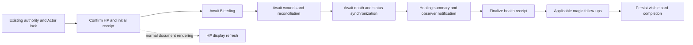

# Combat fluency for the 14.3.0 release candidate

The A–E source changes are implemented for Foundry VTT 14.368 and later supported v14 builds. They extend the existing combat application service, authority bridge, receipts, aftermath bundle, card queue, and AppV2 sheets. There is no schema migration or replacement combat service.

Runtime acceptance and matched live performance measurements are pending. The local Foundry 14.368 instance was at administrator authentication with no active world available during implementation. No world, installed system, release folder, or ZIP was changed. The manifests remain at 14.2.0 until acceptance and the normal 14.3.0 release process.

## Implemented behavior

| Stage | Result | Main source |
| --- | --- | --- |
| A: tracing | Healing is distinguishable by operation kind, Actor, application, receipt, message, and authority request where available. Local spans cover authority persistence/query, lock wait, cast context, absorption, HP persistence, owned consequences, receipt finalization, card persistence, and sheet preparation/rendering. | [Performance tracker](../src/utils/perf-tracker.js), [application service](../src/application/combat/apply-damage-service.js) |
| B: wound calculation | The full-health check uses committed `newHP`, with a current-document fallback for legacy callers. `30/40 + 5` is evaluated as `35/40`. Existing full-health rules remain intact. Existing maimed effects are not repaired automatically. | [Healing wound interaction](../src/core/wounds/wound-engine.js) |
| C: completion | HP commits before Bleeding, wound reconciliation, and death/status synchronization. Healing awaits owned stages, then presents its summary. Failed stages produce partial completion while later stages still run. | [Healing application](../src/core/combat/damage/apply.js), [aftermath bundle](../src/core/combat/damage/aftermath-bundle.js) |
| D: persistence | Basic magic healing skips an empty follow-up claim. Real follow-ups retain their durable claim, persisted without rebuilding card HTML or requesting visible rendering. Receipts and authority flags retain persistence with rendering suppressed for metadata. | [Chat application](../src/core/combat/chat-handlers/combat-chat-apply.js), [shared card updater](../src/core/opposed/shared/card-persistence.js) |
| E: sheets | Structural grouping has a separate revision. HP, temporary HP, and receipt-only updates reuse grouping. Every render gets fresh Item views and current presentation; item/effect and unknown Actor changes invalidate conservatively. | [Item grouping](../src/ui/sheets/sheet-prepare-items.js), [cache invalidation](../src/hooks/init/register-actor-derived-cache-invalidation.js) |



Magic context resolution and absorption retain their existing position before health application. Successful absorption retains its separate receipt and does not run healing consequences. Temporary HP retains its separate semantics and does not reduce Bleeding or progress wounds.

The system emits `uesrpgHealingApplied` once with its existing fields and additive `coreAftermathHandled: true` after owned aftermath has settled. Built-in compatibility listeners skip that handled event. External module listeners still receive the notification; their asynchronous work is outside the system's completion guarantee. Internal GM execution calls the existing owned functions directly. A player requiring GM wound/death authority awaits the existing wound request bridge with additive stage/completion metadata.

Wound reconciliation joins active work and performs a final pass if relevant changes arrive during a pass. Concurrent maimed-outcome requests for the same Actor/wound join one operation; matching existing wound/marker flags avoid redundant writes. A clean-domain shortcut checks wound effects, cleanup effects, and the wounded mirror. Legacy best-effort callers keep their default behavior; the owned healing stages use strict confirmation.

The sheet cache stores grouping order and Item IDs, including membership validation. It does not retain prepared Item objects. Cast charges, range/reach, ammunition controls, religion presentation, and skill bonuses are rebuilt from current data. Item `system` views use a shallow presentation copy so annotations and skill bonuses do not modify live embedded Item data. Existing AppV2 lifecycle, coalesced part rendering, form handling, and layout remain in use.

## Completion, interruption, and replay

- An initial health receipt accompanies the HP write. Its initial partial state distinguishes interrupted work; terminal finalization remains a separate write. The existing 50-entry retention limit remains.
- A committed operation with a failed owned consequence, summary, or receipt finalization remains partial. A card must not describe that operation as fully applied.
- A health-receipt replay returns the recorded result without applying HP, Bleeding, forestalling, treatment progress, or maiming again.
- Real spell follow-ups claim before secondary effects/restoration. A pre-existing claim or replayed/partial health application requires review instead of blindly rerunning consequences. An interrupted final card write can therefore result in a conservative partial card on replay.
- Metadata-only card updates still use fresh-state reads, reconciliation, revision increments, committed-lane protection, authority checks, and the existing per-message queue.
- Per-client locks and bounded receipts retain their existing limits. They do not establish distributed atomicity for arbitrary external document updates or indefinite replay protection.

## Validation completed

Existing checks passed: `npm run lint`, `npm run schema:check`, `npm run data:check`, and `npm run validate`. Release validation covers JavaScript syntax, resolvable imports/templates, import graph, localization/accessibility, authority boundaries, documented v14 compatibility constraints, AppV2 architecture, schema consistency, migration registry, catalogs, and combat dispatch ownership. No new repository test suite was added.

Twenty disposable runtime probes outside the project exercised the actual changed modules with mocked persistence. They covered the premature-maiming regression; actual full-health behavior; confirmed HP before delayed mechanics; chat/condition/death failures; replay; treated-wound cleanup; temporary HP; receipt retention; concurrent reconciliation/maiming; structural invalidation; fresh Item presentation; metadata-only persistence; empty/real magic follow-ups; configured restoration; absorption replay; NPC death/status cleanup; and waiting for/rejection from the existing wound authority bridge.

These probes do not validate Foundry networking, native lifecycle timing, token resolution, module interoperability, or browser layout. Do not treat them as live-world acceptance or performance evidence.

## Collect matched live measurements

Use a disposable copy of a representative world on 14.368 or the exact newer supported build being targeted. Record the Foundry build, system snapshot, enabled modules, client role, Actor/token UUID, inventory/effect sizes, sheet state, and healing amount. Warm the world/sheet before collecting matched runs. Use the same data and route on both snapshots.

Record ordinary and basic magic healing on GM-local and player-to-GM routes, with open and closed PC/NPC sheets and an Actor with substantial inventory/effects. Include wound/Bleeding and clean Actors. Collect enough successful matched samples to make p95 meaningful; report sample counts and separate failure/replay samples. Capture short batches to avoid the existing 500-record ring buffer dropping events.

Enable the existing setting on the disposable world, then disable console logging to reduce diagnostic overhead:

```js
await game.settings.set("uesrpg-3ev4", "timePerformanceDebug", true);
game.uesrpg.perf.console(false);
game.uesrpg.perf.reset();
// Apply the matched healing actions through their usual cards.
const records = game.uesrpg.perf.records();
const healingSummary = game.uesrpg.perf.summarize(records, { kind: "healing" });
console.table(healingSummary);
// Preserve the complete records separately on each participating client.
JSON.stringify(records, null, 2);
// When collection finishes:
await game.settings.set("uesrpg-3ev4", "timePerformanceDebug", false);
game.uesrpg.perf.console(true);
```

| Measure | Records and interpretation |
| --- | --- |
| Confirmed HP persistence | `damage.health.commit`, filtered by `kind: "healing"`, records the awaited HP/receipt commit duration and confirmation. Receipt-only grants can also appear; distinguish them using the action and visible-refresh availability. |
| Visible HP | `healing.visibleHP` observes a connected, laid-out Actor-sheet HP input after confirmed persistence and two animation frames. `durationMs` starts at health-commit entry; `afterCommitMs` isolates the observed refresh after confirmation. It is not click-to-paint or a measurement of every HP display. Closed sheets, unchanged HP, and superseded values have no sample. |
| Owned aftermath | `damage.aftermath.operation` records Bleeding, wounds, target state, and summary separately; filter healing records by `operation`. `damage.aftermath.commit` covers the owned bundle. |
| Card mechanical settlement | `healing.mechanics.settled` includes applicable magic follow-ups before final visible card persistence. Check `status`; partial/replayed records are not successful-completion samples. |
| Overall application and authority | `damage.application` includes Actor lock wait, shared engine, and receipt finalization. `damage.chat.authority` covers authoritative card execution; `damage.chat.request` and `authority.intent.query` cover that client's request interval. Correlate by Actor/message/application/request where present. Never subtract timestamps from different clients. |
| Write/render counts | `authorityProxy.*` records write attempts through the shared document helpers, embedded batch sizes and available confirmations. `authority.intent.write`, `chat.card.persist`, and the `chatSummary` operation record their own persistence. Count each physical path once; HP/receipt phase records overlap proxy records. Native status APIs and external modules can cause additional writes beyond these helper counters. Card render counts measure HTML construction attempts, while sheet `_onRender` records measure observed lifecycle completions. |
| Sheet preparation | `sheet.render.*` records use `stage: "phase:items:cache-hit"` / `"phase:items:cache-miss"` for grouping and named phases for other preparation. `_prepareContext` and `_onRender` record their lifecycle stages. Compare matching sheets and parts. |
| Render correlation | `game.uesrpg.perf.renderImpact()` is a time-window correlation report. It does not establish which write caused a render. |

Summarize median and p95 for the same metric, same route, same client role, and same action class. Include write/render counts and failure counts alongside durations. Do not sum nested spans as though they were disjoint. Do not claim a speed improvement before these measurements.

Snapshot `01-tracing` provides a baseline with the original asynchronous completion boundary. Its application-return time is not proof that all old healing consequences finished. Compare confirmed HP and visible refresh directly; independently observe old mechanical completion before comparing it to the new awaited boundary. A longer pending-button interval may reflect work that was previously detached.

## Focused manual acceptance — pending

- [ ] Ordinary healing, capped healing, overhealing with Bleeding, and healing at full HP; HP/privacy and existing messages agree with document state.
- [ ] Higher, equal, and lower temporary-HP grants preserve distinct semantics and both supported temporary-HP fields.
- [ ] Treated and untreated wounds: `30/40 + 5 → 35/40` has no full-health outcome; an actual full-health transition preserves the existing outcome. Forestalling and treatment progress apply once.
- [ ] NPC healing from zero clears the applicable Dead/Defeated state; existing PC death-state behavior and token overlays remain correct.
- [ ] Basic magic healing has no follow-up claim or intermediate render; real deferred effects and configured restoration retain their claim, completion, and privacy.
- [ ] Eligible/ineligible absorption, failed/successful stored rolls, and replay preserve outcomes without rerolls or duplicate resource restoration.
- [ ] Repeated clicks, simultaneous canonical damage/healing, and interrupted application do not duplicate HP or consequences.
- [ ] Permission rejection, stale cards, missing GM, authority timeout, and failure before/after commitment yield accurate failed/partial feedback.
- [ ] Linked and unlinked Actors, two unlinked tokens sharing a base Actor, and off-scene targets update the correct documents.
- [ ] Potions, regeneration, racial abilities, and over-time healing retain their source-specific calculations through the shared pipeline.
- [ ] Open PC/NPC/group sheets show current equipment and derived values; repeated refreshes do not accumulate skill bonuses. Focus, unsaved inputs, scrolling, and layout remain stable.
- [ ] Representative enabled modules receive compatibility notifications once. External asynchronous work is distinguished from owned completion.
- [ ] Successful completed cards agree with confirmed HP and every applicable built-in consequence. Partial cards remain visible and are reviewable without duplicate application.
- [ ] Matched traces report median/p95, sample counts, write/render counts, and failure counts for visible HP and actual mechanical settlement.

## Review patches and rollback

Source snapshots and forward/reverse patches are outside the checkout at:

```text
C:\dev\uesrpg\combat-fluency-rollback-20261006-230727
```

The stages are `00-original`, `01-tracing` (A), `02-wound-hp` (B), `03-healing-completion` (C), `04-persistence` and `04b-origin-confirmation` (D), `05-sheet-grouping` (E), `06-completion-review` (cross-stage confirmation/diagnostics), and `07-documentation`. Each named patch compares that stage to its immediate predecessor. Reverse them in reverse order. Use source snapshots when byte-exact restoration is needed; this checkout has no usable Git metadata.

The external `restore-source.py` defaults to a dry run, validates workspace/snapshot paths, and refuses to overwrite touched files that differ from the declared starting snapshot. Its external README contains the invocation and the patch order. Preserve later edits before rollback. Source rollback does not reverse HP, effects, or flags already committed to a world; world restoration requires that world's own backup.

## Release boundaries and authoritative references

After acceptance, follow [Release and deployment](Release.md) to update the package/manifest version to 14.3.0, validate, build, and publish through the normal release workflow. Raise `verified` only for an exact build that passed runtime verification. Global over-time indexing, lock replacement, receipt compaction, broad cloning, and parallel combat-boundary execution remain deferred.

API contracts used here are the official Foundry v14 documentation: [Hooks.callAll](https://foundryvtt.com/api/v14/classes/foundry.helpers.Hooks.html#callAll), [document update operations](https://foundryvtt.com/api/v14/interfaces/foundry.abstract.types.DatabaseUpdateOperation.html), [ApplicationV2 lifecycle](https://foundryvtt.com/api/v14/classes/foundry.applications.api.ApplicationV2.html), [confirmed document-update hook](https://foundryvtt.com/api/v14/functions/hookEvents.updateDocument.html), and [Handlebars render parts](https://foundryvtt.com/api/v14/interfaces/foundry.HandlebarsRenderOptions.html). External codebases were inspiration for the study, not API authority.
